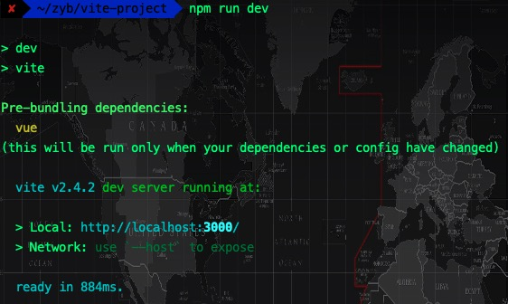
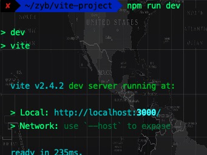
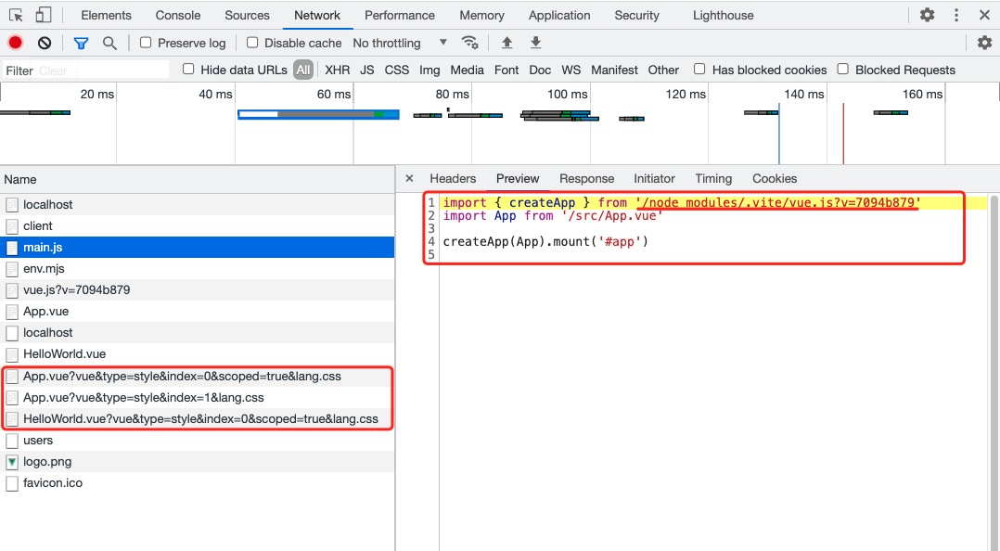
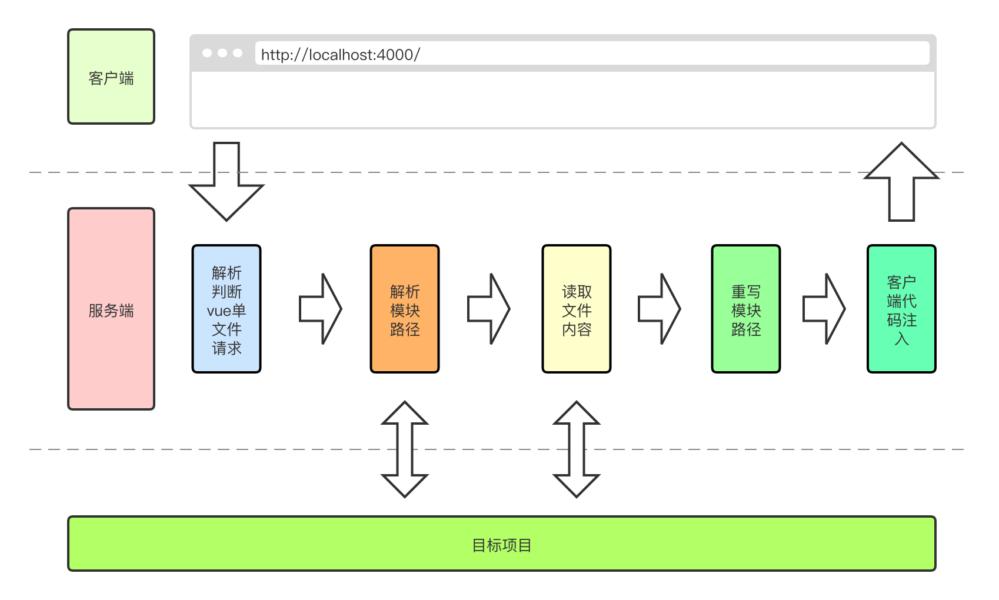
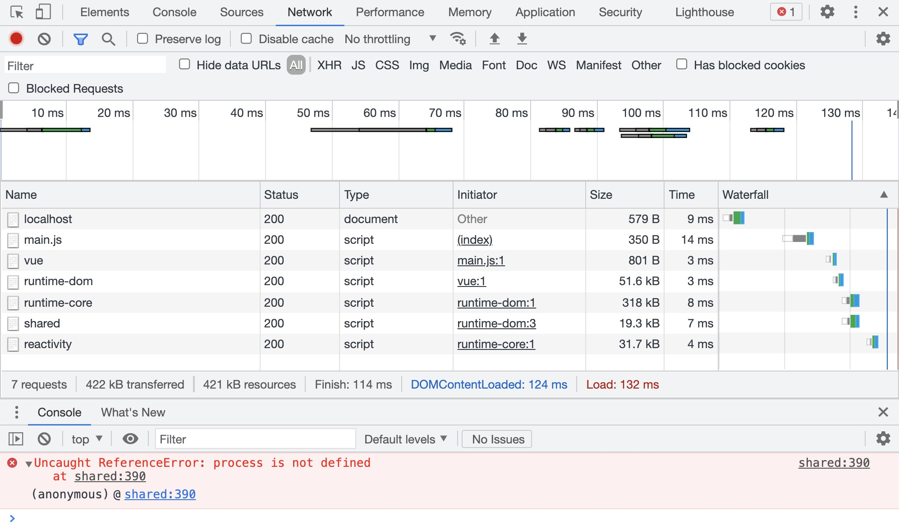

# Vite简介


## 1.什么是Vite 

   

[`vite 官网`](https://cn.vitejs.dev/guide/why.html#the-problems)

下一代前端开发与构建工具

## 2.划重点

1.浏览器支持 ES 模块之前,JavaScript 并没有提供原生机制让开发者以`模块化`的方式进行开发    
2.我们开始构建`越来越大型`的应用时,使用 JavaScript 开发的工具通常需要`很长时间（甚至是几分钟！）`才能启动开发服务器   
3.浏览器开始`原生支持 ES 模块`，`Esbuild`使用go语言编写,并且比JavaScript编写的打包器预构建依赖`快10-100 倍。`    
4.Vite 通过在一开始将应用中的模块区分为 `依赖` 和 `源码` 两类，改进了开发服务器启动时间。   
  + `依赖` 大多为在开发时不会变动的纯 JavaScript（例如 ESM 或者 CommonJS）
  + `源码` 通常包含一些并非直接是 JavaScript 的文件（例如 JSX，CSS 或者 Vue）
  + 同时，并不是所有的源码都需要同时被加载（例如基于路由拆分的代码模块）   

5.Vite 让浏览器接管了`打包程序的部分`工作,只需要在浏览器请求源码时进行`转换`并`按需`提供源码,即只在当前屏幕上实际使用时才会被处理。   

    


简单总结下Vite的主要特点:

1.冷启动速度快   
2.支持更快的热更新   
3.按需更新模块

## 3.先跑一个vite看看🏃


在开始研究它之前,让我们先来看看`Vite`怎么用
### 搭建第一个Vite项目  

> `兼容性注意`
> Vite 需要 Node.js 版本 >= 12.0.0

```bash
$ npm init @vitejs/app
$ cd xxx
$ npm install
$ npm run dev
```
>tips:如果node版本小于12.0.0 ,使用npm init @vitejs/app会报错缺少依赖项

好的,到这里我们的vite已经可以跑起来了,启动后我们会发现第一次启动相比后续的启动,在速度上会慢一些,并且会多出一句提示log,这个提示的意思是在第一次启动时,vite会收集所用的依赖项,并且只有当我们的依赖项或配置改变时，才会再次构建   




接下来我们打开项目生成的目录结构,vite打包的宿主文件是index.html,可以发现 

```html
<script type="module" src="/src/main.js"></script>
```
script的引入方式是模块化的方式,点进/src/main.js,代码如下所示

```js
import { createApp } from 'vue'
import App from './App.vue'

createApp(App).mount('#app')
```
浏览器采用es模块的方式打开index.html,直接请求/src/main.js文件,节省了打包的步骤,然后依次请求main.js中import的文件,实现了按需加载文件,然后我们打开`Network`,刷新页面,可以看到很多请求文件,我们打开其中的main.js可以看到



其中显示的代码和我们本地的文件,只有引入文件的路径是不同的,文件的引入方式,也有一些不同,可以看到vite将vue文件拆成了一个个通过`type`标识的多个请求

## 4.vite的基本架构

好,到这里我们来简单分析一下vite的工作原理,首先vite读取文件,并将模块的`请求路径修改`了,然后就是对`.vue`的文件进行了模块拆分,
>浏览器 => sever => 处理特殊后缀名文件 => 对请求的文件做编译处理成浏览器可直接执行的文件 => 浏览器

原理大概如下图所示

   

## 5.实现一个简易的vite

### 1.创建服务,搭建骨架
首先我们新建一个文件夹,先跑起我们的服务
项目目录如下所示
<pre>
.
├── index.html
├── jml-vite.js
└── src
    ├── App.vue
    ├── main-test.js
    └── main.js
</pre>
然后进入jml-vite.js文件编写如下代码,跑起我们的服务
```js
const koa = require('koa')
const app = new koa()

app.listen(1011, () => {
    console.log('小跑,走起')
})
```
使用 **node jml-vite.js** 命令,跑起我们的服务,这里我们添加一些页面基础,让服务跑起来后显得不那么空白,将jml-vite.js改成如下所示

```js
const koa = require('koa')
const app = new koa()
const fs = require('fs')
const path = require('path')

// 返回宿主页
app.use(async ctx => {
    const { url } = ctx.request
    if (url === '/') {
        // 设置返回类型
        ctx.type = 'text/html'
        ctx.body = fs.readFileSync('./index.html', 'utf-8')
    } 
})

app.listen(1011, () => {
    console.log('小跑,走起')
})
```
将index.html写入以下代码
```html
<!DOCTYPE html>
<html lang="en">
<head>
  <meta charset="UTF-8">
  <meta http-equiv="X-UA-Compatible" content="IE=edge">
  <meta name="viewport" content="width=device-width, initial-scale=1.0">
  <title>Document</title>
</head>

<body>
  123,吓你一跳
  <div id="app"></div>
  <script type="module" src="/src/main-test.js"></script>
</body>
</html>
```
然后将main-test.js写一个试验性的打印语句,我们直接启动我们的服务

### 2.重写模块导入地址

接下来我们来实现修改模块导入地址这部分,首先我们先要搞清楚为什么要修改模块的导入地址?

对于浏览器而言,在我们使用`import`方式导入模块时,浏览器只能识别相对地址和绝对地址(`/`,`./`,`../`),但是我们的代码中常常是直接使用`import vue from 'vue'`这样的方式,引入node_modules中的文件,这种引入方式,浏览器无法识别

 

>Talk is cheap. Show me the code

```js
// 重写导入地址,变成相对地址
function rewriteImport(content) {
    return content.replace(/ from ['"](.*)['"]/g, function (s0, s1) {
        // s0:匹配字符串,s1:分组内容
        if (s1.startsWith('/') || s1.startsWith('./') || s1.startsWith('../')) {
            return s0
        } else {
            return ` from '/@modules/${s1}'`
        }
    })
}
```
这里我们使用`startsWith`匹配路径开头是否是`/`,`./`,`../`,对于非这三项开头的,当然匹配的方式比较简单粗暴,暂时不能处理单纯使用`import 'xxx'`引入的文件,我们直接让他们替换成`/@modules/`,这里`/@modules/`属于我们对路径做的一个标识,后续我将对`/@modules/`进行处理

>对于`import`更好的处理方式,推荐一个库`es-module-lexer`,感兴趣的同学可以去看下

我们修改`jml-vite.js`的代码,
```js
...
if (url === '/') {
  ...
} else if (url.endsWith('.js')) {
  // 将url 转换为绝对路径
  const p = path.join(__dirname, url)
  ctx.type = 'text/javascript'
  // 浏览器无法识别特殊路径
  ctx.body = rewriteImport(fs.readFileSync(p, 'utf-8'))
}
...
```
我们拦截响应的文件，并判断是否是`js`文件，然后调用重写模块路径的方法`rewriteImport`返回给客户端一个解析后的,可以读取正确路径的`js`文件

### 3.解析node_modules文件
接着上一步,我们来处理在上一步中,我们定义的`/@modules/`标识,我们继续修改`jml-vite.js`的代码
```js
else if (url.endsWith('.js')) { 
    ...
} else if (url.startsWith('/@modules/')) {
    const moduleName = url.replace("/@modules/", "")
    const prefix = path.join(__dirname, '../node_modules', moduleName)
    // 要加载的文件
    const module = require(prefix + '/package.json').module
    const realJsFile = fs.readFileSync(path.join(prefix, module), 'utf-8')
    ctx.type = 'text/javascript'
    ctx.body = rewriteImport(realJsFile)
}
...
```
从整个结构来看其实也比较好理解,首先使用`startsWith`匹配`/@modules/`开头的请求,取到后,我们将其重定向到`/node_modules`文件夹下,然后这里我们查看下`/node_modules`中的`package.json`文件

可以看到`package.json`文件中的`module`字段指向的就是模块对应的入口文件,我们直接读取该文件,并返回,然后对于在`/node_modules`中的文件,我们也要小心其引入了类似`import vue from 'vue'`这样的语句,
所以对于读取的`/node_modules`中的文件,我们也采用`rewriteImport`方式处理

至此,我们已经可以正确的跑起来我们的项目了

### 4.客户端注入
跑起我们的项目后,我们会发现,所有的文件资源已经请求正常了,但是会有一个process相关的报错如下所示:

 

对于一般的项目来说，我们经常会去使用process.env去判断环境，而如果你采用脚手架工具进行开发时webpack会来帮我们做这件事，所以在vite中我们也需要对它进行一个处理

我们继续对`jml-vite.js`进行修改,

```js
...
const { url } = ctx.request
if (url === '/') {
    // 设置返回类型
    ctx.type = 'text/html'
    let html = fs.readFileSync('./index.html', 'utf-8')
    html = html.replace(
        '<head>',
        `<head>\n    <script>window.process = {env:{NODE_ENV:'dev'}}</script>`.trim(),
    );
    ctx.body = html
} else if (url.endsWith('.js')) {
...
}
```

简单粗暴的方式,对于该报错,我们首先会想到的处理方式就是在window中注入一个全局变量,并将其插入到`head`标签中,但是如果直接写在html中,肯定是不合适的,会增加开发者的心智负担,这里我们直接采用服务端替换的方式,这样在客户端解析时,就能直接将该段代码执行了

### 5.解析.vue文件
最后,我们开始啃最大的骨头,首先我们先研究下`vite`是如何解析`.vue`文件的,我们先跑起`vite`的服务,来看一下

    

可以看到`vite`是将单个的vue文件,拆分成了几个部分,目前们可以看到css被标记成了`type=style`,在早期的`vite`中,`template`也是一样的处理方式,被标记成`type=template`

`vite`将一个文件中的`script`部分,用一个对象保存,并在下方给该对象添加一个`render`方法,然后导出该对象,而`render`方法对应的,是从`.vite/vue.js`获取的,可以看出其实它本质上是获取在服务端解析好的用于渲染单文件组件中template标签内容的渲染函数

然后就是将多个`style`标签也在服务端解析出来并在客户端以请求的方式获取

**`分类处理`**

首先我们先获得处理`.vue`文件的能力,我们继续改造`jml-vite.js`
```js
const compiler = require('@vue/compiler-sfc') // 解析.vue文件
```
我们引入`@vue/compiler-sfc`这个包,这个模块我们只使用到其提供的`parse`方法,用来将`.vue`文件,解析成各个不同的部分,并返回一个js对象,我们在`jml-vite.js`中使用
```js
else if (url.startsWith('/@modules/')) { 
  ...
} else if (url.endsWith('.vue')) {
    // 读取vue文件并获取AST
    const ast = compiler.parse(fs.readFileSync(p, 'utf-8'))
    console.log('ast', JSON.stringify(ast))
}
...
```

我们查看下效果,并继续对`jml-vite`进行改造

```js
else if (url.startsWith('/@modules/')) { 
  ...
} else if (url.endsWith('.vue')) {
  // 读取vue文件并获取AST
  const ast = compiler.parse(fs.readFileSync(p, 'utf-8'))
  const scriptContent = ast.descriptor.script.content;
  // 重写AST中的裸模块加载
  const script = scriptContent.replace('export default', 'const __script = ')
  ctx.type = 'text/javascript'
  ctx.body = `
      ${rewriteImport(script)}
      import {render as __render} from '${url}?type=template'
      __script.render = __render
      export default __script`
}
```
此时我们从`compiler-sfc`中解析出AST,并将`script`部分拿出来处理,这里需要将原本`script`中可能存在的`export default`改成`const __script = `,主要是因为,最终我们要导出的模块的应该`render`后的部分

这里我们使用`rewriteImport`将`script`部分做处理后返回,避免`script`中还有`import`部分,然后在这里,我们将`template`解析成了另一个请求,给`render`起别名并最终导出` __script`

到这里为止,我们对于`script`部分的解析就完成了
<hr/>

接下来我们解析上文中的`template`,这里我们继续引入`vue`中处理`template`使用的包`@vue/compiler-dom`
```js
const compileDom = require('@vue/compiler-dom') 
```
我们在`jml-vite.js`加入处理`template`的代码
```js
const { url, query } = ctx.request
...
} else if (url.startsWith('/@modules/')) { 
  ...
} else if (url.indexOf('.vue') > -1) {
  const nosearchpath = path.join(__dirname, url.split("?")[0])
  const ast = compiler.parse(fs.readFileSync(nosearchpath, 'utf-8'))
  if (!query.type) {
      // 读取vue文件并获取AST
      const scriptContent = ast.descriptor.script.content;
      // 重写AST中的裸模块加载
      const script = scriptContent.replace('export default', 'const __script = ')
      ctx.type = 'text/javascript'
      ctx.body = ` ${rewriteImport(script)}
      // template解析成另一个请求
      import {render as __render} from '${url}?type=template'
      __script.render = __render
      export default __script`
  } else if (query.type === 'template') {
      const tpl = ast.descriptor.template.content
      // 编译为render模块
      const render = compileDom.compile(tpl, { mode: "module" }).code
      ctx.type = 'text/javascript'
      ctx.body = rewriteImport(render)
  }
}
```

这里我们改造了之前的部分代码,首先我们从`request`中解析出`query`部分,然后我们将`url.endsWith('.vue')`改成`url.indexOf('.vue') > -1`, 因为此时的`.vue`并不一定只存在于最后了,我们截取`search`前的`url`,保存文件源地址,然后开始处理`template`

当`query`中的`type`为`template`时,我们使用`@vue/compiler-dom`将`template`解析成纯`js`,这里我们依然使用`rewriteImport`将解析后的`js`处理后返回
> tips: 目前vite已经将`template`的解析拿掉了所以我们也做一个小改造

```js
...
else if (url.indexOf('.vue') > -1) {
  const nosearchpath = path.join(__dirname, url.split("?")[0])
  const ast = compiler.parse(fs.readFileSync(nosearchpath, 'utf-8'))
  if (!query.type) {
    // 读取vue文件并获取AST
    const scriptContent = ast.descriptor.script.content;
    const tpl = ast.descriptor.template.content
    const render = compileDom.compile(tpl, { mode: "module" }).code
    // 重写AST中的裸模块加载
    const script = scriptContent.replace('export default', 'const __script = ')
    ctx.type = 'text/javascript'
    ctx.body = ` ${rewriteImport(script)}${rewriteImport(render)}
    __script.render = render
    export default __script`
  }
}
```
<hr/>

接下来我们来处理`style`部分,首先是抛出请求

我们继续进入`jml-vite.js`文件
```js
...
else if (url.indexOf('.vue') > -1) {
  ...
if (!query.type) {
    let code = ''
    // 读取vue文件并获取AST
    const scriptContent = ast.descriptor.script.content
    // 重写AST中的裸模块加载
    const script = scriptContent.replace('export default', 'const __script = ')
    code += `${rewriteImport(script)}`

    // 读取style
    const stylesContent = ast.descriptor.styles
    if (stylesContent.length) {
        stylesContent.forEach((item, index) => {
            code += `\nimport "${url}?type=style&index=${index}"\n`
        })
    }

    // 解析template
    const tpl = ast.descriptor.template.content
    const render = compileDom.compile(tpl, { mode: "module" }).code
    code += `${rewriteImport(render)}
    __script.render = render
    export default __script`

    ctx.type = 'text/javascript'
    ctx.body = code
  }
}
```
这里比较好理解,因为`style`在AST解析后是一个数组,我们直接拼接`import`语句,并将`type=style`拼接在后面,让浏览器发起请求,后续我们像之前一样,通过`type`对`style`文件进行处理

```js
if (!query.type) {
  ...
}else if (query.type === 'style') {
  const styleBlock = ast.descriptor.styles[ctx.query.index];
  ctx.type = 'text/javascript';
  ctx.body = `
  const __css = ${JSON.stringify(styleBlock.content)}
  updateCss(__css)
  export default __css
  `
}
```
我们截取`type=style`的请求，拿到它在`descriptor.styles`中的索引位置，然后就能拿到这个`style`标签内部的内容,这里我们直接将`style`解析成`js`然后抛出,并返回给客户端

这里调用了一个`updateCss`函数,好,到这里问题出来了,这是个什么?

原理其实只是想把这个`style`文件,挂在到`html`上,所以我们提取一个公共函数,以便后期处理,然后我们也采用像`process`一样的处理方式,将其预先注入到客户端中

```js
...
const { url, query } = ctx.request
const p = path.join(__dirname, url)

if (url === '/') {
// 设置返回类型
ctx.type = 'text/html'
let html = fs.readFileSync('./index.html', 'utf-8')
html = html.replace(
'<head>',
`<head>\n    <script>
window.process = {env:{NODE_ENV:'dev'}}
function updateCss(css) {
    const style = document.createElement('style');
    style.type = 'text/css';
    style.innerHTML = css;
    document.head.appendChild(style);
}
</script>`.trim(),
);
ctx.body = html
} else if (url.endsWith('.js')){
....
```

## 小记

对于`vite`的解析部分,到这里就结束了,其核心的思想就是利用`esm`的特性,来减少前端对于模块打包的依赖,当然也正是层出不穷的新东西,在推动着前端技术的发展,`vite`可能尚不完美,但他所带来的理念,在未来潜力无限

fighting~ 💪 💪 💪
